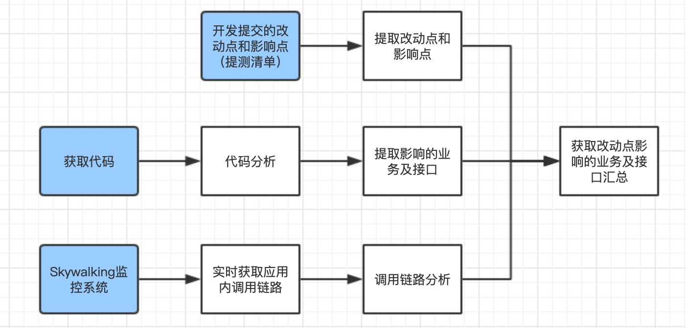
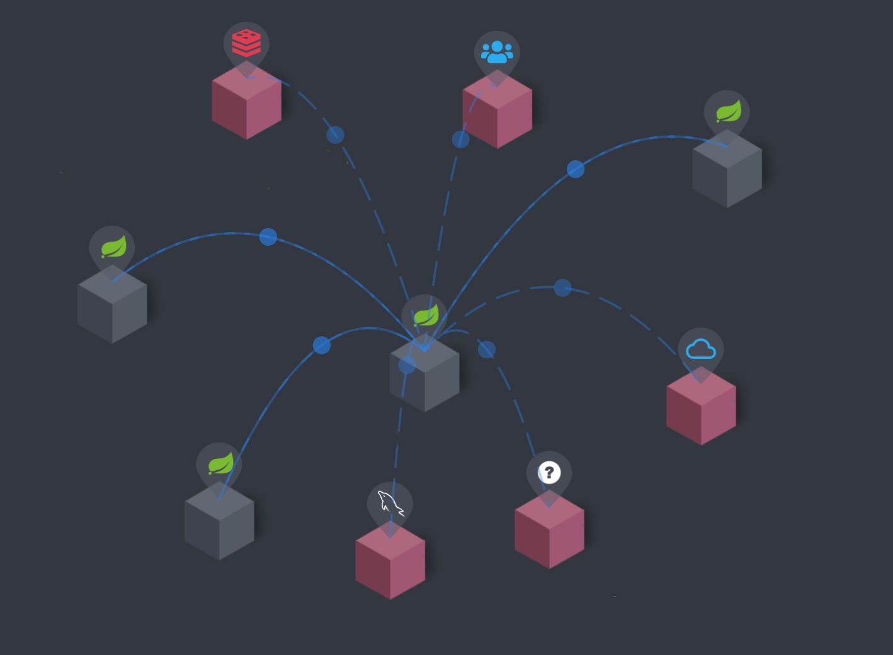
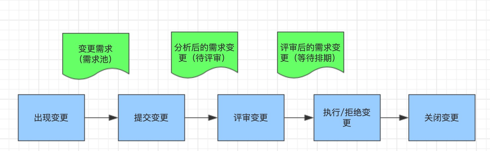
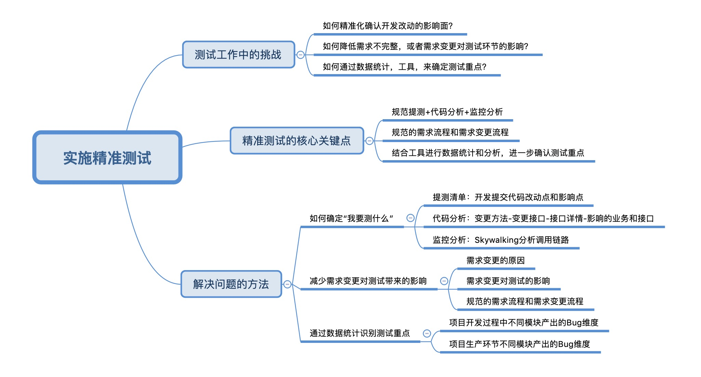

# Test 精准、快速测试学习笔记

## 灵魂拷问

- 这个改动点影响的范围有多大，我需要回归所有功能吗？
- 接口有变动为什么我不知道，引起了线上 Bug？
- 改动的需求会影响这个功能，为什么之前没有想到？
- 我选择的测试重点正确吗，我的测试有效且覆盖完全了吗？

> 这些问题，最终都会影响项目的交付质量。其实，总结归纳一下你就会发现，刚才的那些问题不外乎就 3 个测试痛点：

```docs
1. 如何精准确认开发改动的影响面？
2. 如何降低需求不完整，或者需求变更对测试环节的影响？
3. 如何通过数据统计、测试工具，来确定测试重点？

```

> 那么这三个痛点，该怎么解决呢？我们可以从下面 3 个方面来将这些痛点逐个击破:

```
首先，通过一些工具和方法提取开发改动点和影响面，确定“我要测什么”。
其次，通过规范化需求流程和需求变更流程，降低需求变化对测试环境的影响，减少重新梳理“我要测试什么”的各种资源投入。
最后结合工具进行数据统计，用数据化，可视化的手段帮助测试人员进一步明确测试范围和测试重点，了解自己“测得怎么样”。

```

### 如何确定“我要测什么”

```docs

那在项目实践中，我们的项目由于对业务或数据的准确性和实时性要求很高，同时对市场环境的变化很敏感，需要项目随时作出变化或调整，所以项目会经常产生一些临时或小的需求，针对这些临时或小的需求改动，测试人员往往都是依据开发人员提供的测试点进行测试的，所以经常会出现漏测或者少测的问题，引起线上 Bug。针对这种情况，我们结合精准测试思路做了一些改进。那什么是精准测试？从代码分析的角度，精准测试就是针对应用代码的变更，更有针对性的测试变更部分，使得测试目的更加明确，减少漏测或少测的发生。它的核心部分就是精准圈定代码变更的影响面。

```



> 从这张图中，你可以看三个关键点：

1. 一是规范提测清单：提测的时候，开发需要提交提测清单，提测内容 = 改动的功能 + 影响的功能。
2. 二是代码分析：测试人员比对提交的代码找出变更的方法，定位出变更的接口，然后通过接口详情，提取出影响的业务和接口。
3. 三是监控分析：通过 Skywalking 分析调用链路，进一步找出影响范围，补充核心用例。



```docs
通过规范提测 + 代码分析 + 监控分析结合的方法，我们就可以精准判断出这次改动需要测试的范围和重点了，减少漏测或少测的发生。
那你可能要问了，怎么评估这种改进方法的效果呢？你可以在每周发布后，观察跟踪线上质量，同时结合测试工具（如 Jira Software）的数据分析，定期对线上问题进行分析和总结。我们也是在实践过程中，通过这种反复校验，不断改进的办法，确认了这种方法是有效可行的。

```

### 减少需求变更对测试带来的影响

```docs
那么在精准确认开发的改动点和影响面之后，测试人员就开始执行测试了，为了能够顺利交付，测试人员要面对和解决各种各样的“拦路虎”，其中之一就是需求变更。一旦出现需求变更，那就要重新梳理和分析“我要测什么”，重新制定计划和评估风险，这是我们最不希望发生的。
那么为什么会出现需求变更？我结合工作中遇到的部分案例，总结了一些原因：

```

1. 一是前期需求设计不完整，只实现了一部分功能或逻辑，导致需求断层。
2. 二是需求产出时没有进行合理的调研，导致测试阶段才发现部分功能实现不了或实现有问题。
3. 三是市场环境的变化，比如产品需求需要临时调整或变更。

> 在一个项目中，需求有变动是很正常的。重要的是要搞清楚需求变化带来的影响。

```docs
比如哪些需求发生了变化，这些需求变化后，对测试工作会产生哪些影响，包括对哪些用例产生了影响？当发生较大改动时，还要明确是不是影响到了测试方案，甚至是测试计划。明确这些变化后，我们还要清楚这对项目、对测试进度会产生多大的影响和风险。
明确了需求带来的影响后，我们就要思考如何降低需求不完整，或者需求变更对测试环节的影响。

```

**如何应对需求带来的影响：**

- 预防需求变更：提升需求确定性，把需求分析做好，减少需求变更。
  - 一个项目中需求会经历两个阶段：新生需求（需求池）和确定需求（评审后需求）。应该做为两个面板管理互相独立互相关联。
2. 制定规范的需求变更流程【需求变更流程不能消除变更，但规范需求变更能控制和管理需求的变更，控制在一定的影响范围内】，如图：



3. 通过项目管理工具【tapd, Jira Software】提供的数据统计和分析，把需求不清晰带来的影响透明化，反推产品提高需求质量。


### 通过数据统计识别测试重点

> 通过测试工具多维度收集项目质量数据进行分析和整合，从数据分析的角度判断测试的侧重点。

> 根据模块对应的线上Bug数量初步筛选测试重点，先考虑把排名靠前的模块作为测试重点进行测试。

> 根据业务逻辑的复杂程度确认测试重点，业务逻辑越复杂，改动影响的面越大，所以要作为重点测试模块进行测试。

> 再具体分析用户使用频率和模块缺陷严重程度的分布情况，分梯队对重点模块进行测试。

